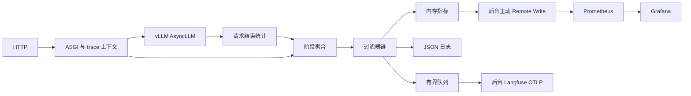

# 需求与架构

| 需求 | 实现 | 验收行为 |
|---|---|---|
| 多实例状态 | 实例主动 Remote Write、心跳超时、本地健康检查、Grafana | 两副本启停，在线/健康数变化 |
| 无业务源码修改的日志 | ASGI + V1 运行时包装 | 每个完成/异常/取消 HTTP 请求一条 JSON |
| 重复阶段汇总 | 每请求 Aggregate | decode 总时间除以首 token 后 token 数 |
| Windows 与昇腾 | 无设备依赖核心、模拟服务、Linux 适配 | 跨平台单测，独立 NPU 验收 |
| trace 与异步上报 | ContextVar、请求 ID 映射、有界队列、OTLP | ID 一致，断网不阻塞请求 |
| 扩展性 | Adapter / Filter / Sink 分离 | 新后端不修改采集适配器 |

## 采集与时间语义

sitecustomize 在相关模块由 vLLM 自己加载完成后安装可选包装；不注册vLLM插件或修改其文件。generate 包装将外部引擎 request ID 关联当前 HTTP trace及当前generation。后台统计通过 external_req_id 查找，不假设继承 ContextVar。生成器结束和取消释放映射；同 HTTP 多调用各自生成独立generation，多序列阶段携带sequence_index，不强行串行拼接。worker仅附加时间元数据，不启动监控服务。原方法先执行，观测错误被隔离；签名/AST检查不能替代真实兼容性测试。

| 阶段 | 定义 |
|---|---|
| http_total | ASGI 进入至应用返回，含流式发送/客户端背压 |
| http_first_body | 首个非空 HTTP body 发出前，可能是 SSE 角色帧，不是模型 TTFT |
| queue | 引擎首次 QUEUED 至首次 SCHEDULED |
| prefill | 首次 SCHEDULED 至首次 NEW_TOKEN，含等待/抢占 |
| decode | 首次 NEW_TOKEN 至最后 NEW_TOKEN，count 为首 token 后的输出 token 数 |

decode mean 按 token 加权，不是 kernel 或调度迭代平均耗时。推测解码一步可产生多 token。单 token 输出 count=0、mean=0。并行序列阶段之和可能超过 HTTP 时间，不能相加当作完整时间轴。缺失阶段保持缺失。

HTTP使用perf_counter差值和请求进入时的墙钟锚点。EngineCore在最终输出上附带同进程monotonic/Unix时间校准，API仅用它转换该引擎的queue/scheduled/first/last边界，不直接比较不同进程的monotonic。校准采样误差作为metadata记录；跨主机要求NTP同步，墙钟跳变/明显偏差会使阶段校验失败。

Langfuse上报真实子span：serve-model-request → generate-response → queue/prefill/decode。decode用首/末token边界形成单个区间并附总数与均值，不按均值制造多个token区间。缺少校准或边界不合法时保留generation和数值汇总，标记timeline_unavailable，不猜测子span起止。

官方skill要求有层级、正确observation类型、模型/token、稳定名字、明确输入输出和环境。这里遵循其[最佳实践](https://langfuse.com/docs/observability/best-practices)，使用[官方支持的vLLM/OTel方式](https://langfuse.com/integrations/model-providers/vllm)保留显式历史起止时间。OpenTelemetry SDK验证版本为1.44.0；未另加Langfuse SDK以避免双重provider/导出。每次请求的所有span一次批量OTLP上报。输入输出仅给路线、计数、状态摘要，不扩大为prompt/文本采集。

## 实例主动上报

每副本后台主动 POST Remote Write 数据到 Prometheus；不使用抓取或 Pushgateway。service/model/instance_id 标识副本，traceId 不作为指标标签。初次成功上报即被识别，零请求也有心跳。

模型健康检查在本进程调用应用 /health，结果连同心跳一起上报；接收端无需访问模型端口。在线定义为 alive=1 且心跳时间在最近30秒。正常退出尽力上报离线，异常退出靠超时判定。历史序列保留不影响当前在线数。

发送任务独立于 Filter 请求链：MetricsFilter 只更新内存，RemoteWriter 定时发送快照。失败不阻塞推理，不排队累积旧心跳；下一周期重试新状态。当前无持久 WAL，断网期间瞬时数据可能丢失；不应宣称无损上报。单副本一个 API 进程，实例 ID 唯一，时间需同步。

## Filter 合约与导出

`process(event) -> event | None`：返回事件继续，None 停止，异常记录后继续。默认 Metrics → Console → AsyncExport。自定义中间件子类通过 filters 参数注入新链。过滤器应快速执行并返回新字典；IO 放后台 Sink。过滤器修改原事件后再异常会影响后续消费者，应避免这种实现。

队列默认 1024，满后丢弃当前 trace 并计数。OTLP 超时预算 2 秒，失败记录计数；不落盘、不保证投递。正常退出等待最多 5 秒，强制退出可丢数据。HTTP 路径无 Langfuse 网络 IO；stdout 日志同步写出，日志采集端需保持畅通。

通过 [Langfuse 官方 OTLP HTTP 入口](https://langfuse.com/integrations/native/opentelemetry) 导出，独立 provider 不修改应用全局配置。W3C traceparent 保留 trace ID/父 span ID；否则接受非全零的 32 位小写十六进制 x-trace-id，非法值生成新 ID。暂不传播 tracestate/baggage，默认全量采集，不依赖上游 sampled 标记。
